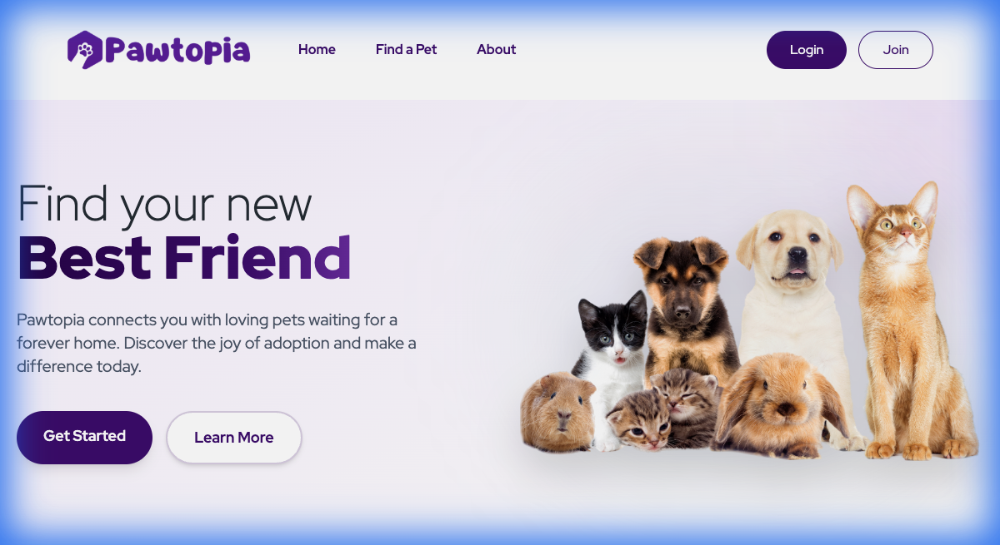
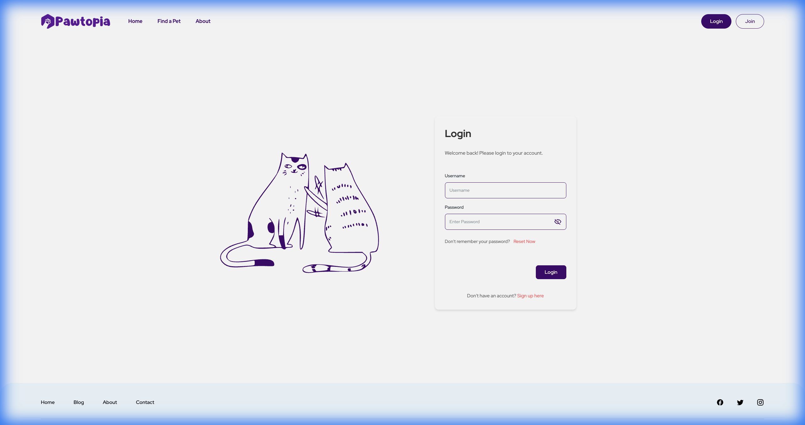
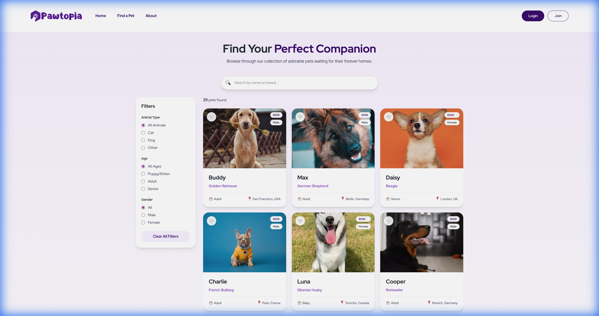

# 🐾 Pawtopia Web App

Pawtopia is a modern, full-stack pet adoption platform connecting loving homes with pets in need. This repository contains the **frontend application**, built with React, TypeScript, and Tailwind CSS.



## 🌟 Features

### 🔍 For Adopters (PawSeeker)
-   **Smart Search:** Filter pets by breed, age, gender, and more.
-   **Rich Profiles:** View high-quality photos and detailed health info.
-   **Favorites:** Save listings to revisit later.
-   **Mobile First:** Fully responsive design for on-the-go browsing.

### 📝 For Listers (PawGuardian)
-   **Easy Listing:** Create detailed pet profiles in minutes.
-   **Dashboard:** Manage your listings and track approval status.
-   **Secure:** Verified accounts for safe rehoming.

### 🛡️ For Admins (PawAdmin)
-   **Moderation:** Review and approve/reject listings.
-   **User Management:** Oversee the platform's community.

## 📸 Screenshots

| Login Page | Browse Pets |
|:---:|:---:|
|  |  |

## 🛠 Tech Stack

-   **Core:** [React](https://reactjs.org/) (v18), [TypeScript](https://www.typescriptlang.org/)
-   **Styling:** [Tailwind CSS](https://tailwindcss.com/), [Sass](https://sass-lang.com/)
-   **State Management:** [Redux Toolkit](https://redux-toolkit.js.org/)
-   **Routing:** [React Router v6](https://reactrouter.com/)
-   **HTTP Client:** [Axios](https://axios-http.com/)
-   **Icons:** [FontAwesome](https://fontawesome.com/), [Iconify](https://iconify.design/)
-   **Notifications:** [React Toastify](https://fkhadra.github.io/react-toastify/)

## 🚀 Getting Started

### Prerequisites
-   Node.js (v14+)
-   npm or yarn
-   Running instance of [Pawtopia Backend](../pawtopia-backend-app)

### Installation

1.  **Clone the repository** (if you haven't already):
    ```bash
    git clone https://github.com/burcuicen/pawtopia.git
    cd pawtopia/pawtopia-web-app
    ```

2.  **Install Dependencies:**
    ```bash
    npm install
    ```

3.  **Configure Environment:**
    Create a `.env.local` file in the root of `pawtopia-web-app`:
    ```env
    # Point to your local backend (default port 8080)
    REACT_APP_API_BASE_URL=http://localhost:8080
    
    # OR point to the production backend
    # REACT_APP_API_BASE_URL=https://pawtopia-backend-app.vercel.app
    ```

4.  **Start the Development Server:**
    ```bash
    npm start
    ```
    The app will open at [http://localhost:3000](http://localhost:3000).

## 📂 Project Structure

```
src/
├── api/            # API client and endpoints
├── assets/         # Static images and icons
├── components/     # Reusable UI components
├── helpers/        # Utility functions and helpers
├── layouts/        # Page layouts (Main, Auth, etc.)
├── pages/          # Application pages (Home, Login, Listings...)
├── store/          # Redux store and slices
├── styles/         # Global styles and variables
└── types/          # TypeScript type definitions
```

## 🤝 Contributing

Contributions are welcome! Please feel free to submit a Pull Request.

## 📝 License

This project is licensed under the MIT License.
